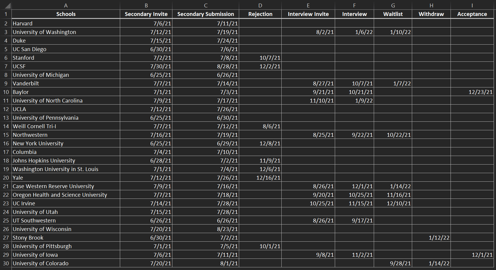

# CycleVis
CycleVis is a simple tool and framework for building visualizations of medical school application cycles.

### Creating Visualizations
To get started, [visit our webapp](https://medschool-cycle-analyzer.herokuapp.com/). Input your medical
school application cycle data by either uploading an excel spreadsheet or google sheet.

Excel Instructions

1. Make a new excel file or download [this template](https://github.com/toofastdan117/Med_School_Cycle_Analyzer/blob/main/example_excel_files/Example%20Excel%20Template.xlsx?raw=true).
2. Create a "Schools" column with your school names (could be dummy names if you want to keep them anonymous).  Make sure to name this column "Schools".
3. Create other columns for all other application events.  You can name these whatever you want.
4. Enter dates for all recorded events.  For schools that have ignored you, or events that you haven't heard of yet, leave these blank.
5. Save the file and make sure that it is in ".xlsx" or ".csv" format.  Once this is done, it is ready to upload!

Google Sheets Instructions

1. Create a google sheet with your data. Feel free to make a copy of the [sample template](https://docs.google.com/spreadsheets/d/1m-pWOmML_MeEa71G2e2FLCWyQzNZdW4s9L1y7Ap5vEY/edit?usp=sharing). The first column must contain schools. Other columns can be any dates of choice (e.g. secondaries, interviews, acceptances, etc.
2. Publish your google sheet by clicking the following: File -> Share -> Publish to Web.
3. Copy the generated link into the text box provided.

After uploading your data, confirm everything looks correct in the displayed table. If you see any mistakes, you can
reupload a corrected file. Otherwise, select a type of visualization from the dropdown menu.

### Contributing Visualizations to the Tool
CycleVis is modular to allow anyone to contribute new visualization types. To get started,
there are a few components you should know about:
1. main.py is run by streamlit and is the backbone for the user interface
2. Collectors are methods inside the collectors.py file. They are used to gather input from the user, and convert
it into a pandas DataFrame for further manipulation.
3. Converters are methods inside the converters.py file. They are used to convert the raw data into other types of
DataFrames that are used for generating a plot.
4. Plotters are modules that are used to display a visualization that is selected by the user. Generally they will call
a converter to convert the raw data into a DataFrame that is specific for this plot, generate the plot, and output it
on the display. Any plot specific input is collected within the plotter.

The general flow of data looks like: Collector -> (Raw Data) -> Converter -> (Cleaned Data) -> Plotter -> (Output Graph)