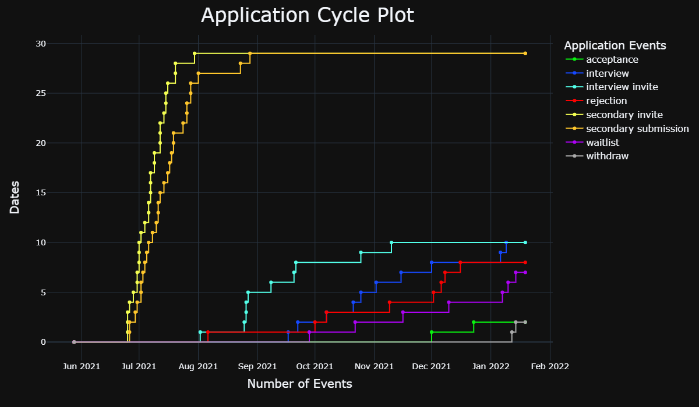

# **Medical School Application Cycle Analyzer**

### Link to webapp: https://medschool-cycle-analyzer.herokuapp.com/

### This is a web program designed for users to upload a formatted excel file of your medical school application cycle (see example) and plot a line graph charting your progress.  The line graph is interactive and may contain more information than a typical Sankey diagram.

### Steps for making a formatted excel doc used for imput:
1.  Make a new excel file.
2.  Create a "Schools" column with your school names (could be dummy names if you want to keep them anonymous).  Make sure to name this column "Schools".
3.  Create other columns for all other application events.  You can name these whatever you want.
4.  Enter dates for all recorded events.  For schools that have ignored you, or events that you haven't heard of yet, leave these blank.
5.  Save the file and make sure that it is in ".xlsx" format.  Once this is done, it is ready to upload!

### Example of a formatted excel file used for input:

### Example Output Line Graph:

